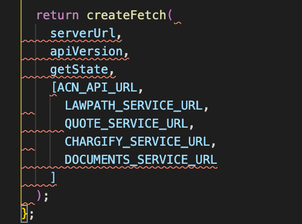
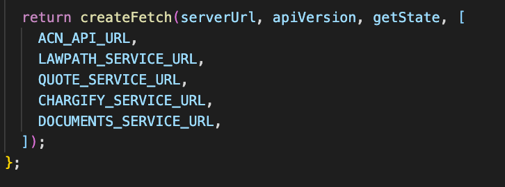
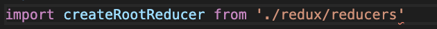
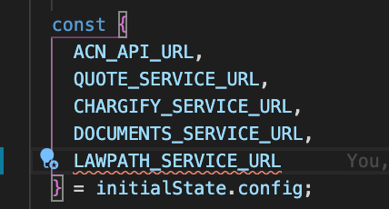
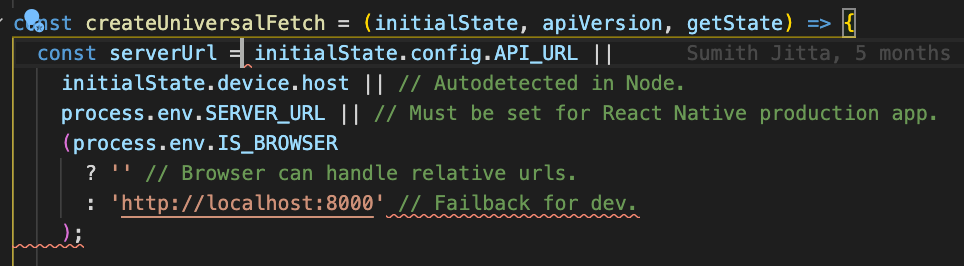
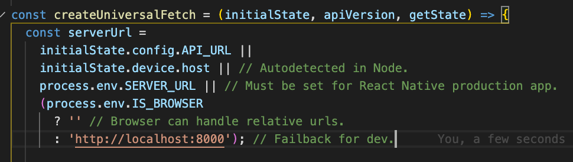

# Lawpath linting rules

To use this module, you must add it as a dependency in your project's `package.json` file:

```json
{
  "devDependencies": {
    "@lawpath/eslint-config": "1.0.0"
  }
}
```

Browser config add this configuration to your `package.json`:

```json
{
  "eslintConfig": {
    "extends": "@lawpath/eslint-config/browser"
  }
}
```

Server config add this configuration to your `package.json`:

```json
{
  "eslintConfig": {
    "extends": "@lawpath/eslint-config/server"
  }
}
```

Then, ensure dependencies are up to date by running `yarn` in your project's root folder.

## Major features

### Less than 4 arguments appear on 1 line. If it goes to 5 then it splits the args onto multi lines





### Ensure we have semi colon at the end as well as trailing commas





### logical operators split to multi line for ease of refactoring


